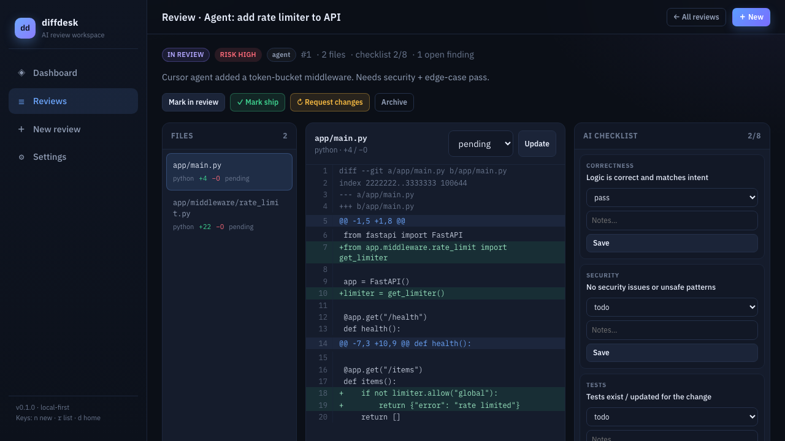

# diffdesk

**Local-first multi-panel web app for reviewing AI-authored code changes.**

Paste an agent/PR unified diff, walk a structured AI-slop checklist, capture findings, and decide ship / request changes — without SaaS lock-in.



## Why diffdesk?

You spend more time *reviewing* Cursor/Claude/Copilot output than writing it. GitHub’s PR UI is fine for human PRs, but AI changes need a tighter loop: risk tags, repeatable checklists (secrets, scope creep, tests), local history of “why I rejected this,” and a JSON API agents can hit before merge.

## Features

- **Modern review desk UI** — sidebar app shell, dashboard, filters, multi-panel detail
- **Unified diff parser** — multi-file patches → file list + colored diff view
- **AI-slop checklist** — correctness, security, tests, naming, scope, secrets, errors, performance (editable template)
- **Findings** — severity-tagged notes tied to files
- **Decisions** — open → in review → ship / changes requested / archived
- **Local SQLite** — data stays on your machine (`~/.diffdesk/diffdesk.db`)
- **REST JSON API** — create/list/update reviews for agent hooks
- **CLI** — `diffdesk serve`, `seed`, `list`, `init`, `version`
- **Demo seed data** — one click / one command

## Install

```bash
python3 -m venv .venv
source .venv/bin/activate   # Windows: .venv\Scripts\activate
pip install -e ".[dev]"
```

Requires Python 3.11+.

## Quick start

```bash
diffdesk init
diffdesk seed          # optional demo reviews
diffdesk serve         # http://127.0.0.1:8788
```

Or:

```bash
python -m diffdesk serve --port 8788
```

Health / API:

```bash
curl -s http://127.0.0.1:8788/api/health
curl -s http://127.0.0.1:8788/api/reviews | head
```

Environment:

| Variable | Meaning |
|----------|---------|
| `DIFFDESK_DB` | Override SQLite path (default `~/.diffdesk/diffdesk.db`) |


## Paste a real git diff (happy path)

```bash
# from any git repo with changes vs main
git diff main...HEAD > /tmp/agent.patch
```

Then open **New review** and paste the contents of `/tmp/agent.patch`.

Tips:
- Prefer unified diffs from `git diff`, `git show`, or GitHub `.patch` downloads.
- Multi-file patches are split into the left file list automatically.
- Empty diff still creates a checklist-only review session.
- API alternative: `POST /api/reviews` with JSON field `diff_text`.

## Use Cases

### 1. After an agent PR lands in your tree
**Who:** Solo developer using Cursor / Claude Code daily  
**Before:** Scroll a 40-file agent diff in GitHub, forget to check secrets, merge, discover hard-coded Redis password later  
**After:** `git diff main...HEAD` → paste into **New review** → walk checklist → flag finding on `rate_limit.py` → **Request changes** with a local record of why  

### 2. Morning review board for a team lead
**Who:** Tech lead watching multiple agent-assisted branches  
**Before:** Slack threads + random PR tabs; no sense of open risk  
**After:** Open Dashboard — counts of open / high-risk / changes-requested; filter Reviews by risk=high; open multi-panel desk and ship or bounce  

### 3. Indie builder keeping “reject memory”
**Who:** Builder iterating with agents on a side project  
**Before:** Same bad patterns reappear; no history of prior rejections  
**After:** Archived reviews with findings (“scope creep in auth helpers”) stay searchable locally for the next agent run  

### 4. Agent pre-merge hook (API)
**Who:** Automation / CI-ish local agent  
**Before:** Agent opens PR with zero structured human gate  
**After:** Agent `POST /api/reviews` with diff JSON; human finishes checklist; agent polls status until `ship` or `changes_requested`  

```bash
curl -s -X POST http://127.0.0.1:8788/api/reviews \
  -H 'Content-Type: application/json' \
  -d '{"title":"agent: foo","source":"agent","risk":"med","diff_text":"..."}'
```

## Why not X?

| Alternative | Gap |
|-------------|-----|
| **GitHub / GitLab PR UI** | Great for collaboration; weak for local AI-slop checklists, offline board, agent JSON handoff |
| **SaaS AI review bots** | Cloud lock-in, cost, privacy — not a local desk you own |
| **prinbox** | Keyboard PR *inbox/triage*, not a deep multi-panel review workspace |
| **breakscan** | Multi-repo contract/break detection — different problem than human review UX |
| **Raw `git diff` + notes** | No structured status, findings, dashboard, or reusable checklist |

## Screens / UX

- **Dashboard** — open, in-review, high-risk, ship counts + recent activity + empty state
- **Reviews** — search + status/risk filters
- **Review detail** — files | diff | checklist + findings + decision bar
- **Settings** — edit default checklist template, DB path, seed

Keyboard: `n` new review · `r` reviews · `d` dashboard (when not typing).

## API (selected)

| Method | Path | Purpose |
|--------|------|---------|
| GET | `/api/health` | Liveness |
| GET | `/api/dashboard` | Stats |
| GET/POST | `/api/reviews` | List / create |
| GET/PATCH | `/api/reviews/{id}` | Detail / update |
| POST | `/api/reviews/{id}/decision` | `{ "status": "ship" \| ... }` |
| PATCH | `/api/checklist/{id}` | Checklist item |
| POST | `/api/reviews/{id}/findings` | Add finding |
| POST | `/api/seed` | Demo data |

Interactive docs: `http://127.0.0.1:8788/docs`

## Development

```bash
pip install -e ".[dev]"
pytest -q
ruff check src tests   # optional
python scripts/generate_project_image.py
```

## Project layout

```
src/diffdesk/
  app.py           # FastAPI HTML + JSON
  db.py            # SQLite
  diff_parse.py    # unified diff parser
  cli.py           # typer CLI
  templates/       # Jinja2 multi-view UI
  static/          # CSS/JS
tests/
docs/images/project.png
```

## License

MIT — see [LICENSE](LICENSE).

## Roadmap

See [ROADMAP.md](ROADMAP.md) for v0.2+ (syntax highlighting, git import, export reports, heuristics).
